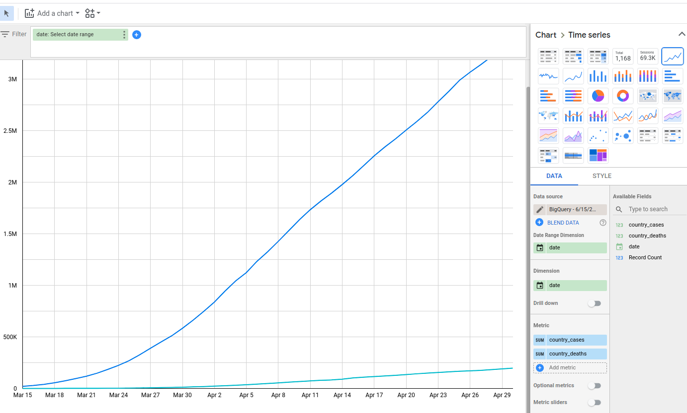

[View Google Cloud Platform Qwiklabs Badge](https://google.qwiklabs.com/public_profiles/d1545912-9488-4f70-8e0e-5a41b479a858/badges/1097124) \
[View My Coursera Certificate](https://coursera.org/share/38c50cdbcad3c408f74708b602918784)

- Performed data analytics on Google Cloud Platform and wrote the **SQL** queries to get the following results.

&nbsp;&nbsp;&nbsp;&nbsp;&nbsp;&nbsp;  Q1. Total Confirmed Cases\
&nbsp;&nbsp;&nbsp;&nbsp;&nbsp;&nbsp;  Q2. Worst Affected Areas\
&nbsp;&nbsp;&nbsp;&nbsp;&nbsp;&nbsp;  Q3. Identifying Hotspots\
&nbsp;&nbsp;&nbsp;&nbsp;&nbsp;&nbsp;  Q4. Fatality Ratio\
&nbsp;&nbsp;&nbsp;&nbsp;&nbsp;&nbsp;  Q5. Identifying Specific day\
&nbsp;&nbsp;&nbsp;&nbsp;&nbsp;&nbsp;  Q6. Finding days with zero net new cases\
&nbsp;&nbsp;&nbsp;&nbsp;&nbsp;&nbsp;  Q7. Doubling Rate\
&nbsp;&nbsp;&nbsp;&nbsp;&nbsp;&nbsp;  Q8. Recovery Rate\
&nbsp;&nbsp;&nbsp;&nbsp;&nbsp;&nbsp;  Q9. CDGR - Cumulative Daily Growth Rate\

Each queries were written separately.

- Accessed and analyzed the public dataset 'covid-19-public-data' within GCP.

- SKILLS APPLIED: ANSI SQL, Machine Learning, Data Visualization(DataViz), SQL, Google Cloud Platform, Cloud Computing, data analysis, business analysis, business intelligence, cloud engineering.
- Coursera Link: https://www.coursera.org/specializations/from-data-to-insights-google-cloud-platform 

